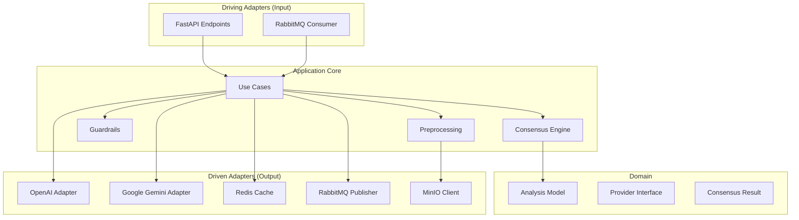
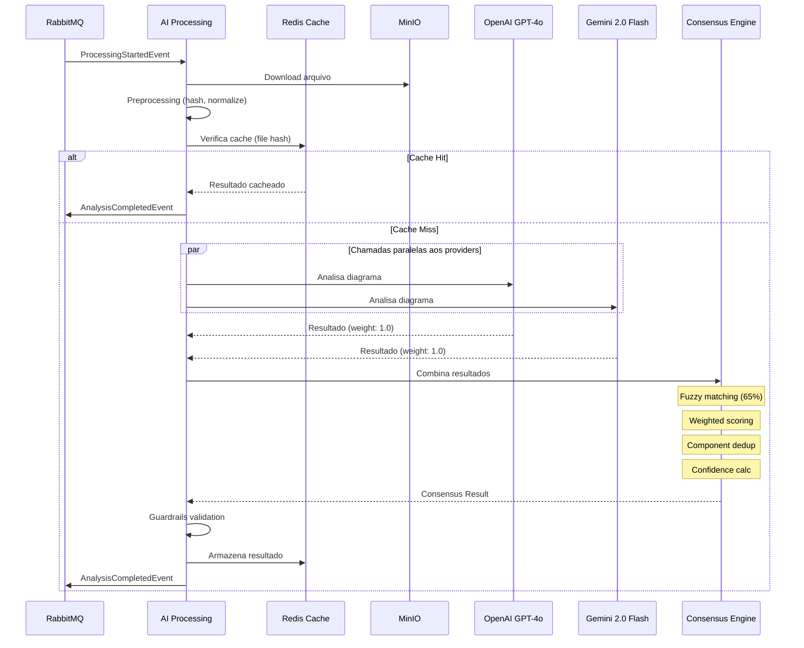
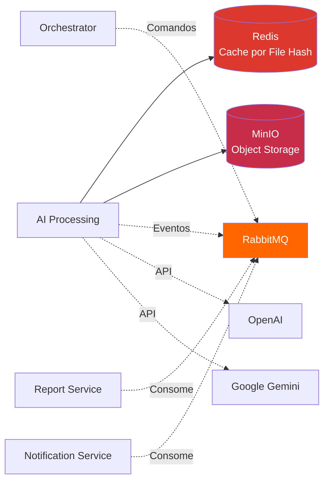
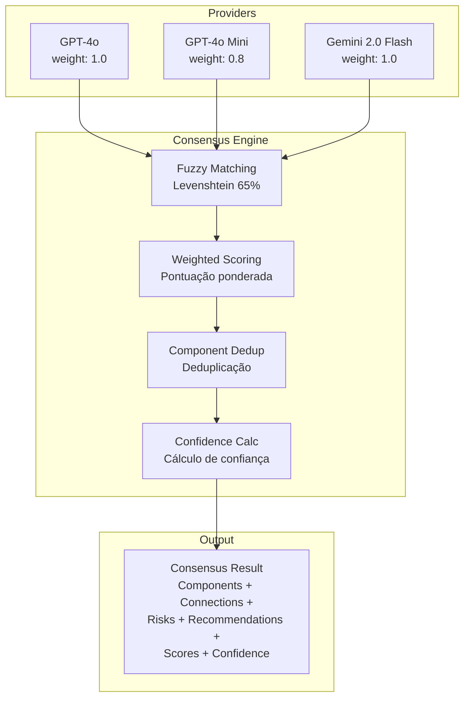
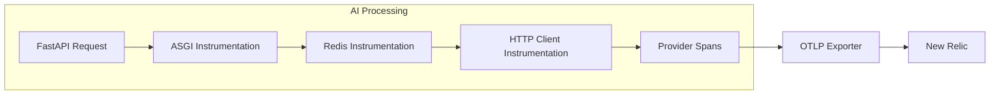

# ArchLens - AI Processing Service

[](https://github.com/archlens-platform/archlens-ai-processing/actions/workflows/ci.yml)
[](https://sonarcloud.io/summary/new_code?id=archlens-platform_archlens-ai-processing)
[](https://sonarcloud.io/summary/new_code?id=archlens-platform_archlens-ai-processing)
[](https://sonarcloud.io/summary/new_code?id=archlens-platform_archlens-ai-processing)
[](https://sonarcloud.io/summary/new_code?id=archlens-platform_archlens-ai-processing)
[](https://sonarcloud.io/summary/new_code?id=archlens-platform_archlens-ai-processing)
[](https://sonarcloud.io/summary/new_code?id=archlens-platform_archlens-ai-processing)
[](https://sonarcloud.io/summary/new_code?id=archlens-platform_archlens-ai-processing)

> **Microsserviço de Processamento de IA Multi-Provider com Motor de Consenso**
> Hackathon FIAP - Fase 5 | Pós-Tech Software Architecture + IA para Devs
>
> **Autor:** Rafael Henrique Barbosa Pereira (RM366243)

[](https://www.python.org/)
[](https://www.docker.com/)
[](https://alistair.cockburn.us/hexagonal-architecture/)
[](https://fastapi.tiangolo.com/)
[](https://redis.io/)
[](https://www.rabbitmq.com/)

## 📋 Descrição

O **AI Processing Service** é o microsserviço responsável pela análise arquitetural inteligente de diagramas e documentos. Utiliza **múltiplos provedores de IA** (OpenAI, Google Gemini) com um **Motor de Consenso** que combina os resultados via fuzzy matching (Levenshtein), pontuação ponderada e deduplicação de componentes para produzir análises confiáveis. Inclui **cache por hash de arquivo** no Redis para evitar re-análises, **guardrails** de validação de schema e filtragem de limites, além de suporte a **chat de follow-up** contextual sobre análises existentes.

## 🏗️ Arquitetura

O projeto segue os princípios de **Arquitetura Hexagonal** (Ports & Adapters):



## 🔄 Pipeline de Análise Multi-Provider



## 🛠️ Tecnologias

| Tecnologia | Versão | Descrição |
|------------|--------|-----------|
| Python | 3.11+ | Linguagem principal |
| FastAPI | 0.100+ | Framework web async |
| Pydantic | 2.x | Validação de modelos |
| OpenAI SDK | 1.x | Client para GPT-4o / GPT-4o Mini |
| Google GenAI | 0.x | Client para Gemini 2.0 Flash |
| python-Levenshtein | 0.x | Fuzzy matching para consenso |
| Redis (aioredis) | 7+ | Cache de análises por file hash |
| aio-pika | 9.x | Client async para RabbitMQ |
| MinIO SDK | 7.x | Client para object storage |
| Uvicorn | 0.x | ASGI server |

## 🔒 Isolamento de Banco de Dados

> ⚠️ **Requisito:** "Nenhum serviço pode acessar diretamente o banco de outro serviço."

O AI Processing Service **não possui banco de dados relacional próprio**. Utiliza Redis exclusivamente como **cache de resultados** (por hash de arquivo) e MinIO para **download de arquivos** enviados pelo Upload Service. A comunicação com outros serviços é feita **apenas via RabbitMQ (eventos)**:



**Eventos publicados:** `AnalysisCompletedEvent`, `AnalysisFailedEvent`
**Eventos consumidos:** `ProcessingStartedEvent`

## 📁 Estrutura do Projeto

```
archlens-ai-processing/
├── app/
│   ├── adapters/
│   │   ├── inbound/
│   │   │   ├── api/                        # FastAPI routes
│   │   │   │   ├── health.py               # Health check endpoint
│   │   │   │   ├── analyze.py              # POST /api/analyze
│   │   │   │   └── chat.py                 # POST /api/chat/{analysis_id}
│   │   │   └── messaging/                  # RabbitMQ consumers
│   │   │       └── processing_consumer.py
│   │   │
│   │   └── outbound/
│   │       ├── providers/                  # AI Provider adapters
│   │       │   ├── openai_provider.py      # GPT-4o + GPT-4o Mini
│   │       │   └── gemini_provider.py      # Gemini 2.0 Flash
│   │       ├── cache/                      # Redis cache adapter
│   │       ├── storage/                    # MinIO adapter
│   │       └── messaging/                  # RabbitMQ publisher
│   │
│   ├── core/
│   │   ├── domain/                         # Domain models
│   │   ├── ports/                          # Port interfaces
│   │   └── use_cases/                      # Application use cases
│   │
│   ├── engine/
│   │   ├── consensus.py                    # Motor de Consenso
│   │   ├── fuzzy_matching.py               # Levenshtein matching
│   │   ├── weighted_scoring.py             # Pontuação ponderada
│   │   └── deduplication.py                # Dedup de componentes
│   │
│   ├── guardrails/
│   │   ├── schema_validator.py             # Validação de schema
│   │   └── limit_filter.py                 # Filtragem de limites
│   │
│   ├── preprocessing/
│   │   ├── file_hash.py                    # Hash SHA-256 do arquivo
│   │   └── format_normalizer.py            # Normalização de formato
│   │
│   └── main.py                             # Entry point FastAPI
│
├── tests/
│   ├── unit/                               # Testes unitários
│   ├── integration/                        # Testes de integração
│   └── conftest.py                         # Fixtures compartilhadas
│
├── Dockerfile
├── requirements.txt
└── pyproject.toml
```

## 🚀 Como Executar

### Opção 1: Docker Compose (Recomendado) ✨

Clone o repositório [archlens-docs](https://github.com/archlens-platform/archlens-docs) e execute:

```bash
docker-compose up -d
```

### Opção 2: Manual

#### Pré-requisitos
- Python 3.11+
- Docker (para Redis, RabbitMQ e MinIO)

#### Passos

```bash
# 1. Subir infraestrutura
docker-compose -f docker-compose.infra.yml up -d

# 2. Criar virtual environment
python -m venv venv
source venv/bin/activate

# 3. Instalar dependências
pip install -r requirements.txt

# 4. Executar a API
uvicorn app.main:app --host 0.0.0.0 --port 8000 --reload
```

A API estará disponível em: `http://localhost:8000`

## 📡 Endpoints

| Método | Endpoint | Descrição |
|--------|----------|-----------|
| GET | `/api/health` | Health check do serviço e providers |
| POST | `/api/analyze` | Inicia análise de diagrama arquitetural |
| POST | `/api/chat/{analysis_id}` | Chat de follow-up sobre uma análise existente |

### Chat Follow-up

O endpoint `/api/chat/{analysis_id}` permite fazer **perguntas contextuais** sobre uma análise já realizada, sem necessidade de reprocessar o diagrama:

```json
{
  "question": "Quais são os maiores riscos de escalabilidade nessa arquitetura?"
}
```

## 📊 Motor de Consenso

O **Consensus Engine** combina resultados de múltiplos providers de IA para produzir uma análise unificada e confiável:



### Provedores de IA

| Provider | Modelo | Weight | Fallback Order |
|----------|--------|--------|----------------|
| OpenAI | GPT-4o | 1.0 | 1º |
| OpenAI | GPT-4o Mini | 0.8 | 2º |
| Google | Gemini 2.0 Flash | 1.0 | 3º |

### Degradação Graceful (Fallback)

O sistema opera com **degradação graceful** — se provedores falham, o consenso é calculado com os que responderam:

| Cenário | Providers ativos | Comportamento |
|---------|-----------------|---------------|
| Ideal | 3 | Consenso completo com alta confiança |
| Parcial | 2 | Consenso com confiança reduzida |
| Crítico | 1 | Resultado direto do provider (sem consenso) |
| Falha total | 0 | `AnalysisFailedEvent` publicado |

## 📨 Eventos

### Eventos Consumidos

| Evento | Ação |
|--------|------|
| `ProcessingStartedEvent` | Inicia pipeline de análise (download → preprocess → providers → consenso → cache) |

### Eventos Publicados

| Evento | Quando |
|--------|--------|
| `AnalysisCompletedEvent` | Análise concluída com sucesso (inclui resultado do consenso) |
| `AnalysisFailedEvent` | Falha na análise (todos os providers falharam ou erro interno) |

## 🧪 Testes

```bash
# Rodar todos os testes
pytest

# Rodar com cobertura
pytest --cov=app --cov-report=html

# Testes unitários apenas
pytest tests/unit/

# Testes de integração (requer Docker)
pytest tests/integration/
```

## 🔧 Configuração

### Variáveis de Ambiente

| Variável | Descrição |
|----------|-----------|
| `OPENAI_API_KEY` | Chave de API da OpenAI (GPT-4o / GPT-4o Mini) |
| `GOOGLE_AI_API_KEY` | Chave de API do Google (Gemini 2.0 Flash) |
| `REDIS_URL` | URL de conexão Redis (cache) |
| `RABBITMQ_URL` | URL de conexão RabbitMQ |
| `MINIO_ENDPOINT` | Endpoint do MinIO (object storage) |
| `MINIO_ACCESS_KEY` | Access key do MinIO |
| `MINIO_SECRET_KEY` | Secret key do MinIO |
| `CONSENSUS_THRESHOLD` | Threshold de fuzzy matching (padrão: `0.65`) |
| `CACHE_TTL_SECONDS` | TTL do cache Redis (padrão: `86400`) |

## 🐳 Docker

```bash
docker build -t archlens-ai-processing .
docker run -p 8000:8000 archlens-ai-processing
```

## 📈 Health Checks

```
GET /api/health    # Health check com status dos providers e dependências
```

Resposta:

```json
{
  "status": "healthy",
  "providers": {
    "openai_gpt4o": "available",
    "openai_gpt4o_mini": "available",
    "gemini_2_flash": "available",
  },
  "redis": "connected",
  "rabbitmq": "connected",
  "minio": "connected"
}
```

## 📊 Observabilidade

O serviço possui integração com **OpenTelemetry** e logging estruturado:

### OpenTelemetry (Traces + Metrics)



**Instrumentações:**
- `FastAPI / ASGI` - Traces de requisições HTTP
- `Redis` - Traces de operações de cache
- `HTTP Client` - Traces de chamadas aos providers de IA
- `Custom Spans` - Consensus engine, preprocessing, guardrails

**Métricas:**
- Latência por provider
- Taxa de cache hit/miss
- Contagem de análises (sucesso/falha)
- Tempo do motor de consenso

### Logging Estruturado

```json
{
  "timestamp": "2026-03-15T00:00:00Z",
  "level": "INFO",
  "message": "Consensus achieved",
  "extra": {
    "analysis_id": "guid-123",
    "providers_responded": 3,
    "providers_failed": 1,
    "confidence": 0.87,
    "consensus_time_ms": 245,
    "cache_hit": false,
    "service": "ai-processing"
  }
}
```

---

FIAP - Pós-Tech Software Architecture + IA para Devs | Fase 5 - Hackathon (12SOAT + 6IADT)
